# Readlr SRS — Module Artifacts (v1.2)

This document provides the artifacts referenced in each module of the Readlr SRS v1.2.

**Format notes:**
- All diagrams are written in **Mermaid** syntax. They render natively in GitHub, GitLab, Notion, Obsidian, and VS Code (Markdown Preview Mermaid plugin). To export to PNG/SVG for the final SRS document, paste each diagram into <https://mermaid.live> and use the export button.
- **Use Case Descriptions** follow the standard Cockburn fully-dressed template.
- **Wireframes** are presented as textual layout specifications. The MVP screens for Companion Character (GameLevel) and Teacher Analytics (FluencyHeatmap) already exist in the prototype codebase and may be screen-captured directly as the wireframe artifact.

---

## Global Actors (referenced across modules)

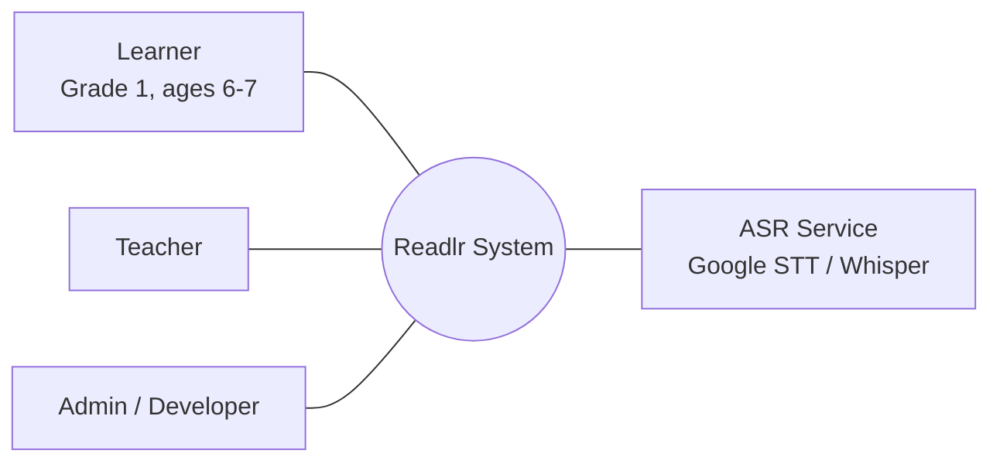

---

# Module 1: Story-Based Learning System

## 1.1 Story Progression Module

### 1.1.1 Use Case Diagram

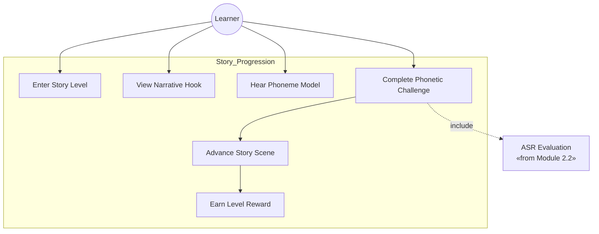

### 1.1.2 Use Case Description — UC-1.1: Complete a Story Level

| Field | Description |
|---|---|
| **Use Case ID** | UC-1.1 |
| **Name** | Complete a Story Level |
| **Actor** | Learner (Grade 1 student) |
| **Goal** | Progress through one narrative level by correctly pronouncing the target phoneme/word |
| **Preconditions** | Learner is signed in; the previous level (if any) is completed; device microphone is functional |
| **Trigger** | Learner taps the level on the Stage Selection screen |
| **Main Flow** | 1. System loads the level scene and Sinta appears (Idle state)<br/>2. Sinta delivers the **Hook** in simple English<br/>3. Sinta delivers the **Model** — speaks the target phoneme with animated mouth shape<br/>4. Learner taps the microphone button (**Action**)<br/>5. System captures audio and invokes ASR (UC-2.2)<br/>6. System receives confidence score and applies Fluency Tier classifier (UC-2.5)<br/>7. If confidence ≥ threshold: Sinta enters Celebrating state, scene animation plays, sticker awarded, next scene loads<br/>8. Level completes when all challenges in the level are passed |
| **Alternate Flow A — Incorrect attempt** | 6a. Confidence < threshold → Sinta enters Encouraging state → corrective feedback loop (UC-2.2) → return to step 4 |
| **Alternate Flow B — Self-correction** | 6b. Attempt N+1 passes after attempt N failed without corrective loop being shown → Self-Correction recognized (UC-2.4) → Self-Correction Star awarded |
| **Alternate Flow C — ASR failure** | 5a. ASR network error or timeout → system shows retry prompt; learner state preserved |
| **Postconditions** | Level marked complete; Reading Attempt Records persisted; next level unlocked |
| **Frequency** | Multiple times per session |
| **Non-functional** | Sinta state transitions ≥30 fps; ASR round-trip ≤3 s |

### 1.1.3 Activity Diagram

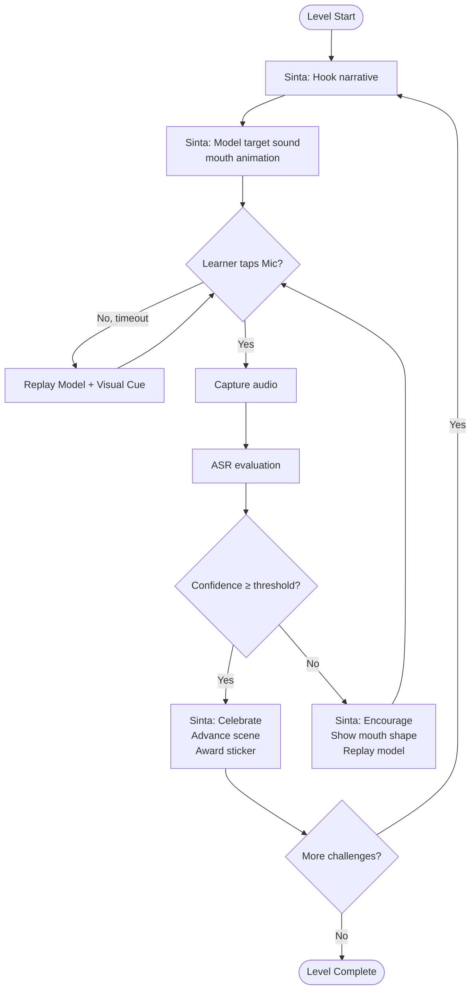

### 1.1.4 Wireframe — Story Level Screen

```
┌──────────────────────────────────────────────────────┐
│  [← Back]                              ⭐ Score: 300 │
│                                                       │
│  ● ● ●  ○ ○        ← progress dots (5 levels)        │
│                                                       │
│                  ┌─────────────┐                     │
│                  │ Hi! Help me │  ← speech bubble    │
│                  │ open the    │                      │
│                  │ magic door! │                      │
│                  └──────┬──────┘                     │
│                                                       │
│                  ╱ ◕   ◕ ╲                          │
│                 │    ‿     │   ← Sinta (Idle state)  │
│                  ╲___🌟___╱                          │
│                                                       │
│                  ┌─────────┐                         │
│                  │    A    │   ← phoneme card        │
│                  └─────────┘                         │
│                                                       │
│         ┌──────────┐  ┌────────────────┐            │
│         │ 🔊       │  │    🎤          │            │
│         │ Listen   │  │   Say it!      │            │
│         └──────────┘  └────────────────┘            │
└──────────────────────────────────────────────────────┘
```
**Implemented in:** `src/app/components/GameLevel.tsx`

---

## 1.2 Level Navigation Module

### 1.2.1 Use Case Diagram

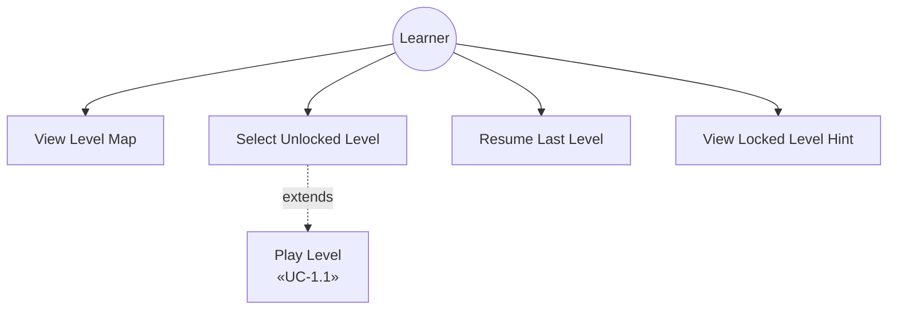

### 1.2.2 Use Case Description — UC-1.2: Navigate to a Level

| Field | Description |
|---|---|
| **Use Case ID** | UC-1.2 |
| **Name** | Navigate to a Level |
| **Actor** | Learner |
| **Goal** | Select a level to play from the stage map |
| **Preconditions** | Learner has completed onboarding |
| **Trigger** | Learner taps any stage on the Welcome screen |
| **Main Flow** | 1. System displays the Stage Selection screen with completed (✓), current (highlighted), and locked (🔒) levels<br/>2. Learner taps an unlocked level<br/>3. System transitions to the Game Level screen and loads the level<br/>4. UC-1.1 executes |
| **Alternate Flow A** | 2a. Learner taps a locked level → system shows hint: "Finish [previous level] first!" — no transition |
| **Postconditions** | Selected level becomes the active level |
| **Rules** | Strictly linear: level N+1 unlocks only when level N is completed (Vygotsky scaffolding) |

### 1.2.3 Activity Diagram

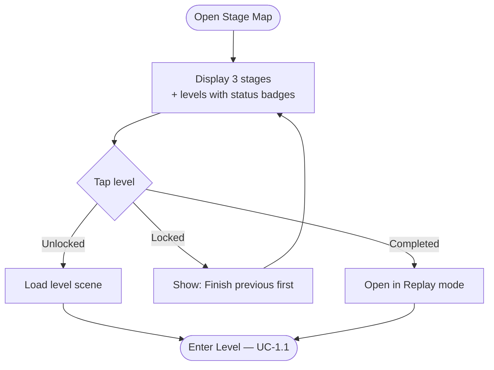

### 1.2.4 Wireframe — Stage Selection

```
┌──────────────────────────────────────────────────────┐
│ [← Home]            Choose your Adventure            │
│                                                       │
│  ╔═══════════════════════════════════════════════╗   │
│  ║  STAGE 1 — Valley of Vowels                   ║   │
│  ║  [✓] [✓] [✓] [▶3] [🔒] [🔒]                   ║   │
│  ╚═══════════════════════════════════════════════╝   │
│                                                       │
│  ╔═══════════════════════════════════════════════╗   │
│  ║  STAGE 2 — Blending Bridges            🔒    ║   │
│  ║  Complete Stage 1 to unlock                   ║   │
│  ╚═══════════════════════════════════════════════╝   │
│                                                       │
│  ╔═══════════════════════════════════════════════╗   │
│  ║  STAGE 3 — CVC Kingdom                 🔒    ║   │
│  ╚═══════════════════════════════════════════════╝   │
└──────────────────────────────────────────────────────┘
```
**Implemented in:** `src/app/components/StageSelection.tsx`

---

# Module 2: Speech Recognition Learning System

## 2.1 Pronunciation Challenge Module

### 2.1.1 Use Case Diagram

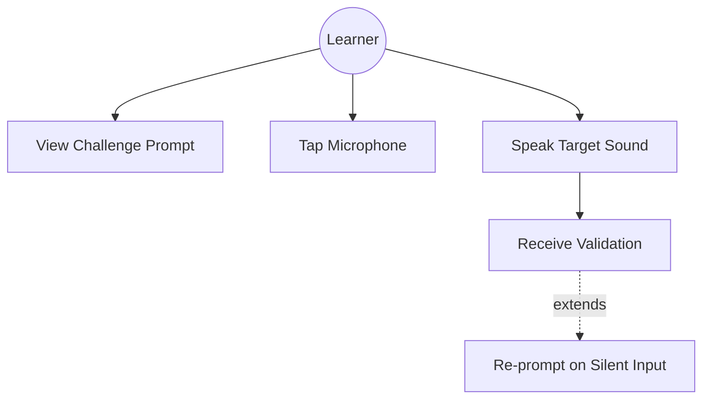

### 2.1.2 Use Case Description — UC-2.1: Submit a Pronunciation Attempt

| Field | Description |
|---|---|
| **Use Case ID** | UC-2.1 |
| **Name** | Submit a Pronunciation Attempt |
| **Actor** | Learner |
| **Goal** | Record a voice attempt at the target phoneme/word for evaluation |
| **Preconditions** | A challenge is displayed; microphone permission granted |
| **Trigger** | Learner taps the on-screen microphone button |
| **Main Flow** | 1. System enters Listening state (Sinta shows pulse rings)<br/>2. System captures audio for up to 3 seconds<br/>3. System stops capture on silence or max duration<br/>4. System routes audio to ASR Feedback Engine (UC-2.2) |
| **Alternate Flow A — Silent input** | 3a. No detectable voice activity → system re-prompts: "I didn't hear you — try again!" |
| **Alternate Flow B — Premature stop** | 2a. Learner taps mic again before completion → capture ends early; routed to ASR with current buffer |
| **Postconditions** | Audio buffer dispatched to ASR; attempt counter incremented |
| **Non-functional** | Total interaction ≤3 s (Nielsen 1994) |

### 2.1.3 Activity Diagram

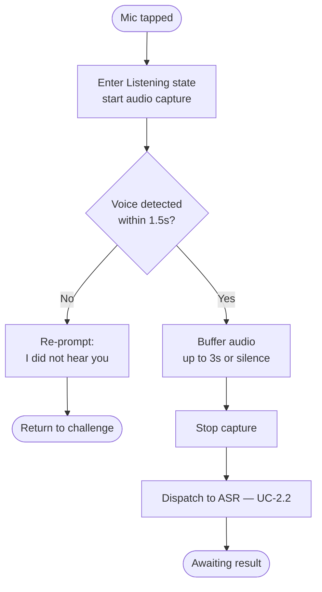

### 2.1.4 Wireframe
Same screen as UC-1.1 wireframe; Listening state shows pulse rings around Sinta, mic button turns rose-red and pulses.

---

## 2.2 ASR Feedback Engine

### 2.2.1 Use Case Diagram

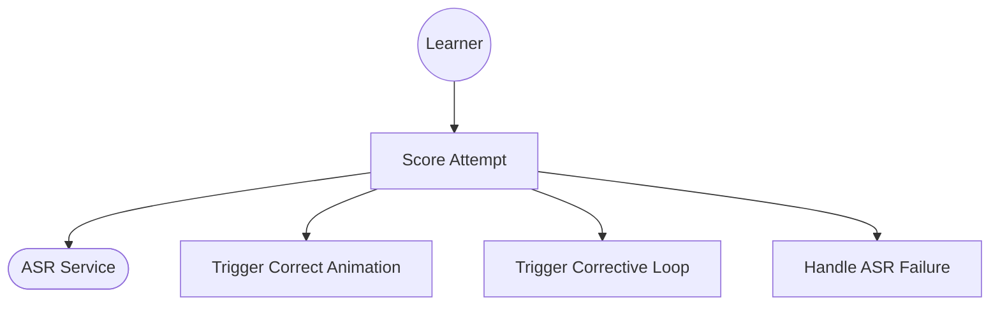

### 2.2.2 Use Case Description — UC-2.2: Evaluate Pronunciation

| Field | Description |
|---|---|
| **Use Case ID** | UC-2.2 |
| **Name** | Evaluate Pronunciation |
| **Actor** | Learner (initiator); ASR Service (supporting) |
| **Goal** | Produce a confidence score and trigger appropriate feedback |
| **Preconditions** | Audio buffer received from UC-2.1 |
| **Trigger** | Audio dispatched to ASR |
| **Main Flow** | 1. System sends audio + grammar constraints + hotwords to ASR<br/>2. ASR returns transcript and confidence score<br/>3. System compares confidence to threshold (default 0.70)<br/>4. If ≥ threshold: trigger correct-answer animation within ≤2 s; pass result to Fluency Tier Classifier (UC-2.5)<br/>5. If < threshold: trigger corrective feedback loop |
| **Corrective Feedback Loop** | (a) Sinta enters Encouraging state<br/>(b) Sinta replays correct audio with Demonstrating mouth shape<br/>(c) Retry prompt displayed |
| **Alternate Flow A — Network failure** | 1a. ASR call fails or times out (>3 s) → no crash; system shows retry prompt; attempt is not recorded |
| **Alternate Flow B — Empty transcript** | 2a. ASR returns no result → treat as silent input; re-prompt |
| **Postconditions** | Confidence score available; Reading Attempt Record created (UC-2.5); Self-Correction check evaluated (UC-2.4) |
| **Non-functional** | ≥85% recognition accuracy on predefined phoneme inputs; round-trip ≤3 s; ≥75% second-attempt success target |

### 2.2.3 Activity Diagram

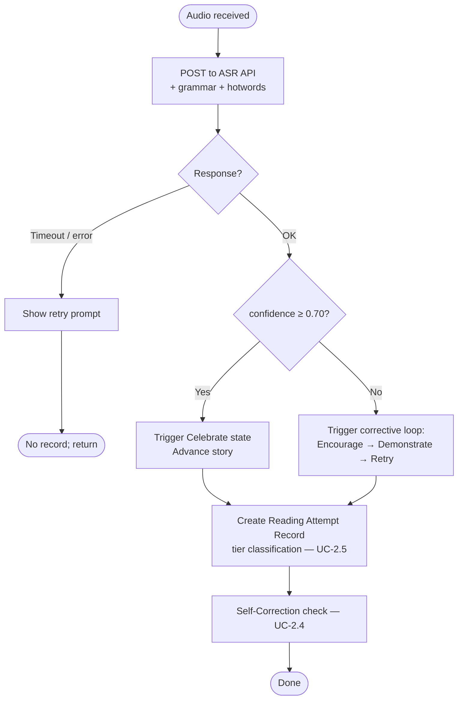

### 2.2.4 Wireframe
Same screen as UC-1.1 wireframe; below the buttons, on incorrect attempt, the speech bubble updates to "Let's try again together. Watch my mouth!" and Sinta plays the mouth-shape animation.

---

## 2.3 Companion Character Module ("Sinta")

### 2.3.1 Use Case Diagram

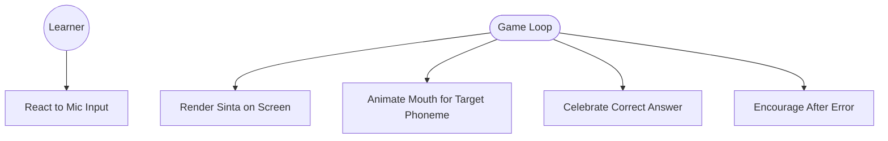

### 2.3.2 Use Case Description — UC-2.3: Companion Character Lifecycle

| Field | Description |
|---|---|
| **Use Case ID** | UC-2.3 |
| **Name** | Companion Character Lifecycle |
| **Actor** | Learner (observer); Game Loop (driver) |
| **Goal** | Sinta exhibits the correct behavioral state for every gameplay event |
| **Preconditions** | A gameplay screen is active |
| **Trigger** | Gameplay state changes (challenge load, mic active, ASR result) |
| **Main Flow** | 1. On screen load → Idle state<br/>2. On "Listen" tap → Speaking/Demonstrating with phoneme-specific mouth shape<br/>3. On "Say it" tap → Listening state (pulse rings)<br/>4. On ASR correct → Reacting (Celebrating)<br/>5. On ASR incorrect → Reacting (Encouraging) → Speaking/Demonstrating |
| **Postconditions** | Sinta state matches the most recent gameplay event |
| **Rules** | (a) No punitive visual ever shown; (b) Dialogue strings externalized; (c) Idle drift to Thinking after 3 s of inactivity |

### 2.3.3 Activity Diagram

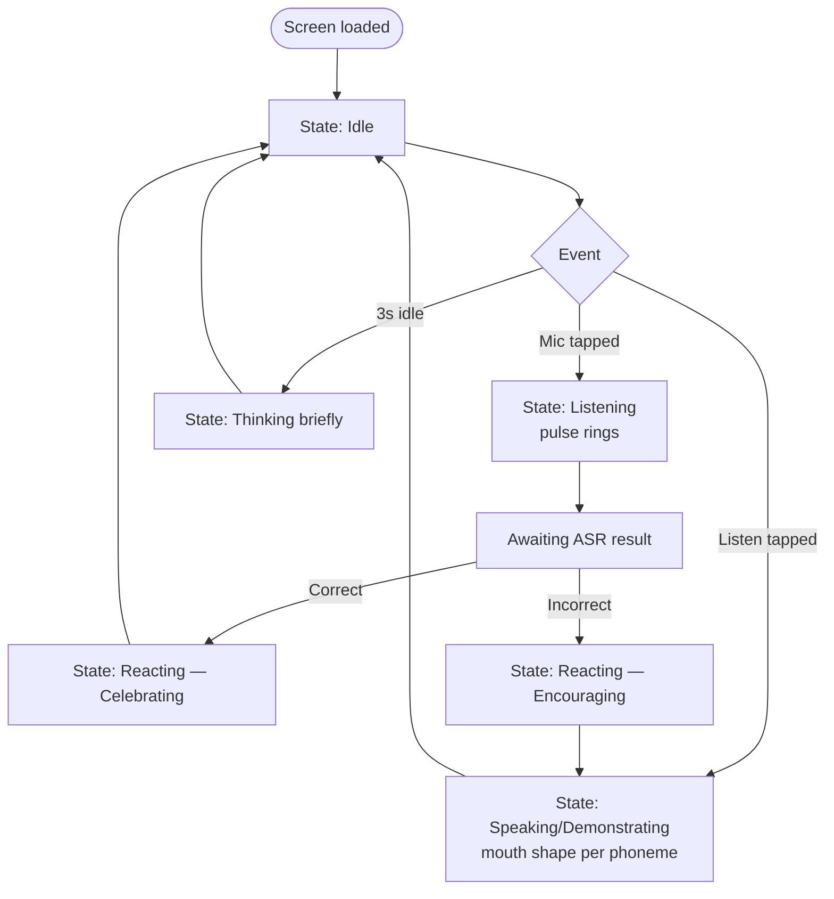

### 2.3.4 Character State Diagram

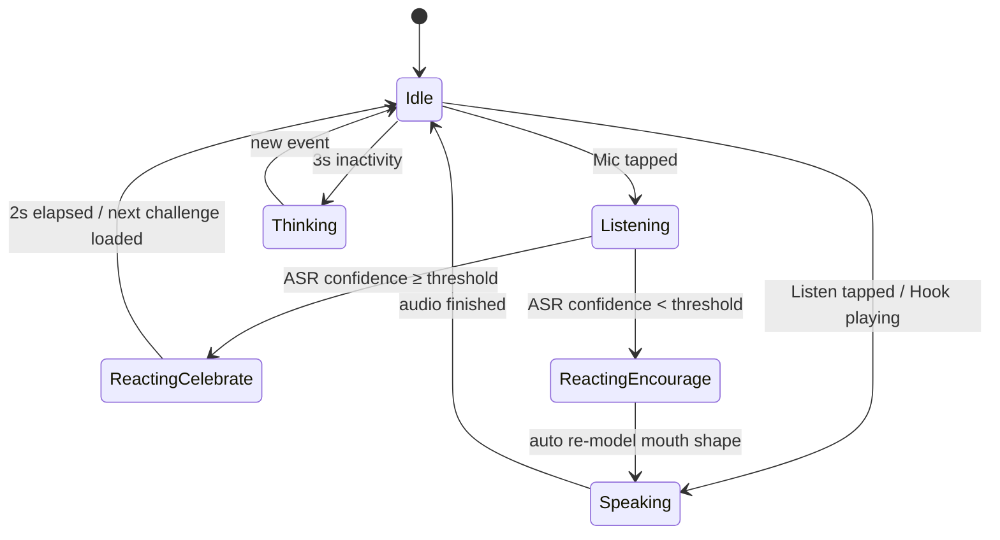

### 2.3.5 Wireframe
**Implemented in:** `src/app/components/CharacterCompanion.tsx` and `src/app/components/GameLevel.tsx`. Character occupies the central 40% of the screen vertical real estate, with the speech bubble above and phoneme card + buttons below. Pulse rings extend 20% beyond the character bounding box.

---

## 2.4 Self-Correction Recognition

### 2.4.1 Use Case Diagram

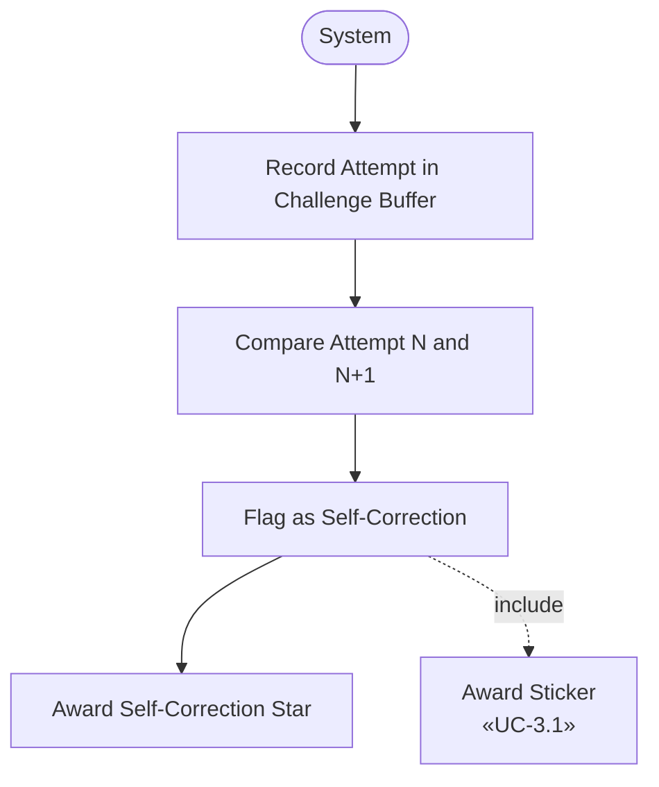

### 2.4.2 Use Case Description — UC-2.4: Detect a Self-Correction

| Field | Description |
|---|---|
| **Use Case ID** | UC-2.4 |
| **Name** | Detect a Self-Correction |
| **Actor** | System (no learner action; runs as post-condition of UC-2.2) |
| **Goal** | Identify and reward unprompted error correction |
| **Preconditions** | At least 2 attempts exist in the current challenge buffer |
| **Trigger** | A new Reading Attempt Record is created |
| **Main Flow** | 1. Retrieve attempt N (most recent prior) and attempt N+1 (current) for this challenge<br/>2. Check: attempt N's `accuracy < threshold` AND attempt N+1's `accuracy ≥ threshold` AND `correctiveLoopShown[N→N+1] = false`<br/>3. If all true → set `selfCorrected = true` on attempt N+1<br/>4. Trigger UC-3.1 to award Self-Correction Star<br/>5. Increment learner's weekly Self-Correction counter |
| **Alternate Flow A — First attempt** | 1a. No prior attempt exists → skip; not a self-correction |
| **Alternate Flow B — Corrective loop was shown** | 2a. `correctiveLoopShown = true` → not a self-correction; record stored without flag |
| **Postconditions** | Reading Attempt Record persisted with `selfCorrected` flag; sticker awarded if applicable |

*(No Activity Diagram or Wireframe required per SRS.)*

---

## 2.5 Fluency Tier Classification

### 2.5.1 Use Case Diagram

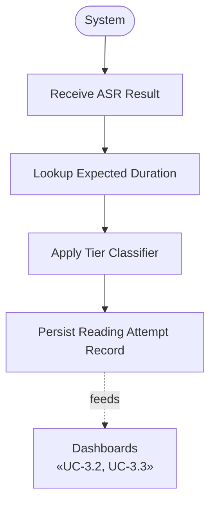

### 2.5.2 Use Case Description — UC-2.5: Classify Attempt into Fluency Tier

| Field | Description |
|---|---|
| **Use Case ID** | UC-2.5 |
| **Name** | Classify Attempt into Fluency Tier |
| **Actor** | System |
| **Goal** | Tag every voice attempt with Fluent / Halting / Syllabic |
| **Preconditions** | ASR returned a confidence score and totalDurationMs |
| **Trigger** | Reading Attempt Record creation (post UC-2.2) |
| **Main Flow** | 1. Look up `expectedDurationMs` for the target word in the Phoneme & Vocabulary Bank<br/>2. Apply classifier:<br/>   • `Syllabic` if `accuracy < 0.70` OR `totalDurationMs > expected × 2.0`<br/>   • `Halting` if `totalDurationMs > expected × 1.4` (and not Syllabic)<br/>   • `Fluent` otherwise<br/>3. Set `tier` field on the record<br/>4. Write to local storage<br/>5. Notify dashboards (push or pull) |
| **Postconditions** | Record persisted; tier visible in dashboards within ≤500 ms |
| **Non-functional** | Classification completes ≤500 ms |

### 2.5.3 Activity Diagram

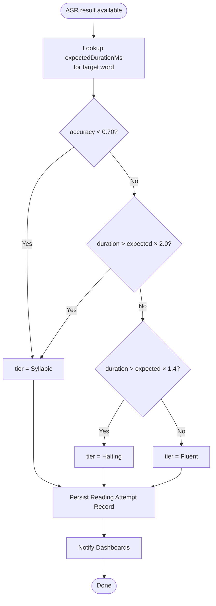

### 2.5.4 Data Model Diagram

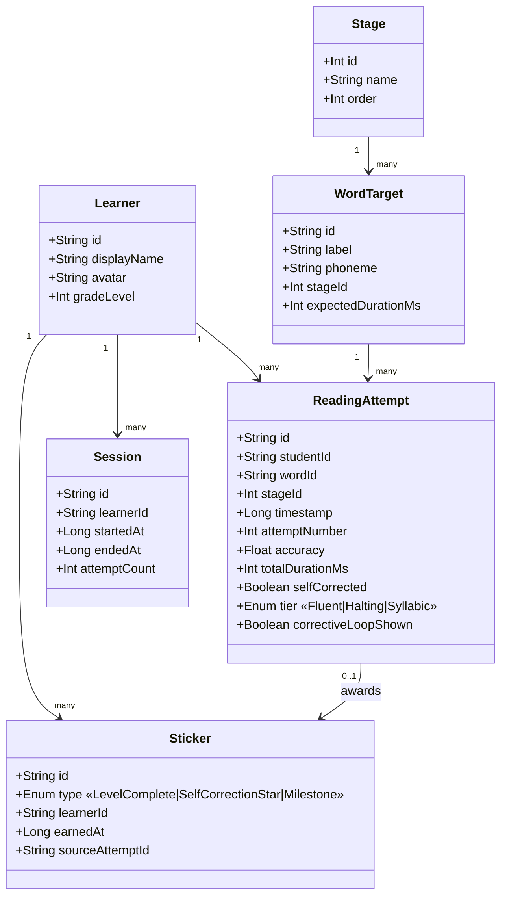

### 2.5.5 Wireframe
Not learner-facing; this module is invisible infrastructure. Its output appears in dashboards (§3.2, §3.3).

---

# Module 3: Reward and Engagement System

## 3.1 Sticker Reward System

### 3.1.1 Use Case Diagram

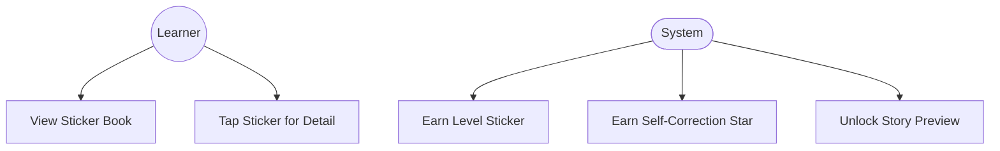

### 3.1.2 Use Case Description — UC-3.1: Award Sticker

| Field | Description |
|---|---|
| **Use Case ID** | UC-3.1 |
| **Name** | Award Sticker |
| **Actor** | System |
| **Goal** | Grant a sticker upon a reward-eligible event |
| **Preconditions** | Triggering event occurred (level complete OR self-correction OR milestone reached) |
| **Trigger** | Level completion event OR `selfCorrected = true` on a Reading Attempt Record OR weekly milestone threshold crossed |
| **Main Flow** | 1. System determines sticker type (LevelComplete / SelfCorrectionStar / Milestone)<br/>2. System creates Sticker record linked to the learner and source event<br/>3. System triggers reward animation overlay<br/>4. Sticker appears in the Sticker Book on next open |
| **Alternate Flow A — Duplicate** | 1a. Sticker already exists for this source → skip silently |
| **Postconditions** | Sticker persisted; learner's weekly sticker counter incremented |
| **Non-functional** | ≥70% daily sticker milestone completion target (Skinner 1938) |

### 3.1.3 Activity Diagram

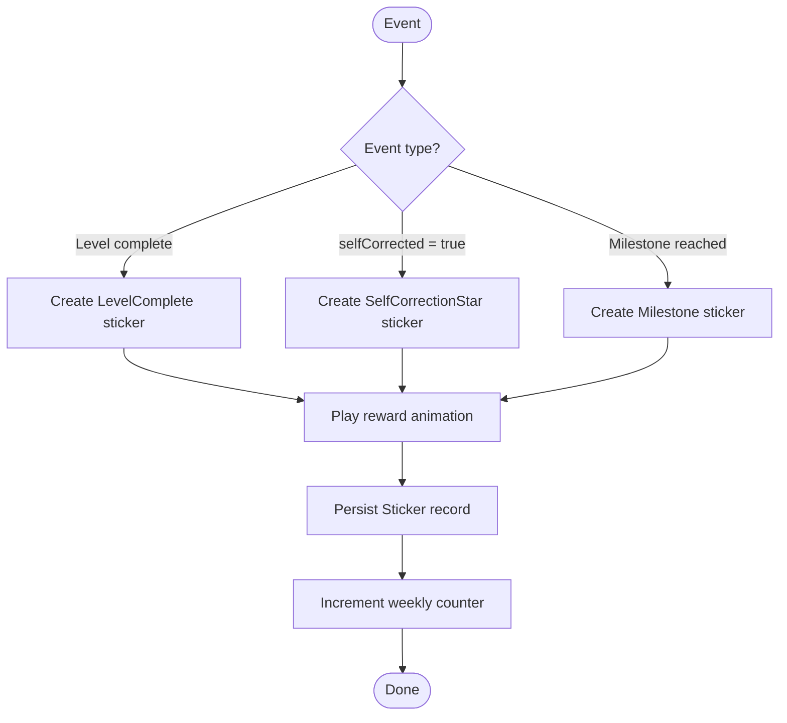

### 3.1.4 Wireframe — Sticker Book

```
┌──────────────────────────────────────────────────────┐
│ [← Back]              My Sticker Book                │
│                                                       │
│  ⭐ THIS WEEK: 12 stickers · 3 Self-Correction Stars │
│                                                       │
│  Level Stickers                                      │
│  ┌────┐ ┌────┐ ┌────┐ ┌────┐ ┌────┐ ┌────┐         │
│  │ 🦊 │ │ 🐰 │ │ 🐻 │ │ ?? │ │ ?? │ │ ?? │         │
│  └────┘ └────┘ └────┘ └────┘ └────┘ └────┘         │
│                                                       │
│  ⭐ Self-Correction Stars  (you fixed it yourself!) │
│  ┌────┐ ┌────┐ ┌────┐                              │
│  │ ⭐ │ │ ⭐ │ │ ⭐ │                              │
│  └────┘ └────┘ └────┘                              │
│                                                       │
│  Milestones                                          │
│  ┌────┐ ┌────┐                                       │
│  │ 🏆 │ │ ?? │                                       │
│  └────┘ └────┘                                       │
└──────────────────────────────────────────────────────┘
```
**Implemented in:** `src/app/components/StickerBook.tsx` (Self-Correction section pending)

---

## 3.2 Progress Tracking Module

### 3.2.1 Use Case Diagram

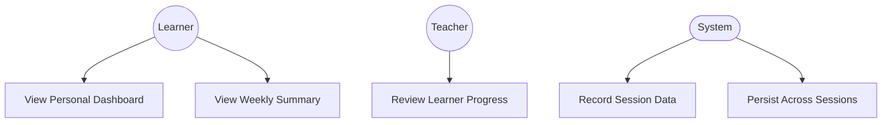

### 3.2.2 Use Case Description — UC-3.2: View Personal Progress

| Field | Description |
|---|---|
| **Use Case ID** | UC-3.2 |
| **Name** | View Personal Progress |
| **Actor** | Learner (primary); Teacher (read-only secondary) |
| **Goal** | Display the learner's recent activity, fluency distribution, and rewards |
| **Preconditions** | At least one session has been logged |
| **Trigger** | Learner taps "My Progress" from main menu |
| **Main Flow** | 1. System loads Reading Attempt Records, Stickers, and Session records for this learner<br/>2. System renders: completed levels, sticker count, accuracy trend, **Fluency Tier distribution per stage**, **Self-Correction Stars this week**<br/>3. System renders weekly summary card (per Deci & Ryan 1985) |
| **Postconditions** | Dashboard visible; no state mutation |
| **Non-functional** | Renders in ≤1 s for up to 500 records |

### 3.2.3 Activity Diagram

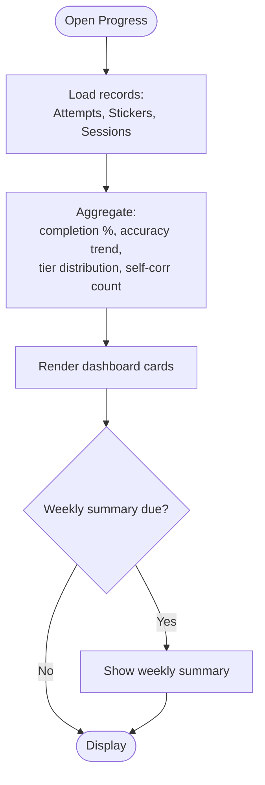

### 3.2.4 Wireframe — Student Progress Dashboard

```
┌──────────────────────────────────────────────────────┐
│ [← Back]               My Progress                   │
│                                                       │
│  ┌──────────┐ ┌──────────┐ ┌──────────┐ ┌─────────┐│
│  │ Levels   │ │ Accuracy │ │ Stickers │ │ ⭐ Self │ │
│  │  8 / 23  │ │   85%    │ │    14    │ │   3 ★   │ │
│  └──────────┘ └──────────┘ └──────────┘ └─────────┘│
│                                                       │
│  Fluency by Stage                                    │
│  Stage 1: ████████░░ 80% Fluent                     │
│  Stage 2: ████░░░░░░ 40% Fluent                     │
│  Stage 3: ░░░░░░░░░░ Not yet attempted              │
│                                                       │
│  Accuracy Trend (last 7 sessions)                    │
│  ▁▃▄▆▆▇█  ← line chart                              │
│                                                       │
│  This Week's Summary                                 │
│  • Completed 4 levels                                │
│  • Earned 6 stickers                                 │
│  • Fixed 3 mistakes on your own!                     │
└──────────────────────────────────────────────────────┘
```
**Implemented in:** `src/app/components/ProgressDashboard.tsx`

---

## 3.3 Teacher Analytics Module — Fluency Heatmap

### 3.3.1 Use Case Diagram

```mermaid
flowchart TB
    T((Teacher))
    UC1[Open Teacher Dashboard]
    UC2[Select Stage]
    UC3[View Heatmap Grid]
    UC4[Inspect Cell Detail]
    UC5[View Class Trouble Spots]
    UC6[Identify Pull-Aside Students]
    T --> UC1 --> UC2 --> UC3
    UC3 --> UC4
    UC3 --> UC5
    UC3 --> UC6
```

### 3.3.2 Use Case Description — UC-3.3: Review Class Fluency

| Field | Description |
|---|---|
| **Use Case ID** | UC-3.3 |
| **Name** | Review Class Fluency |
| **Actor** | Teacher |
| **Goal** | Identify class-wide patterns and individual students needing support |
| **Preconditions** | Teacher mode is active; Reading Attempt Records exist for at least one learner |
| **Trigger** | Teacher selects "Fluency Heatmap" tab on the Teacher Dashboard |
| **Main Flow** | 1. System loads all Reading Attempt Records for learners in this class<br/>2. System aggregates the **most recent** tier per student × word for the selected stage<br/>3. System renders the grid (rows = students, columns = words), color-coded green/amber/red/gray<br/>4. System renders top metrics (% Fluent class-wide, Self-Correction Stars this week, Pull-Aside count)<br/>5. System renders Trouble Spots panel<br/>6. Teacher hovers/taps a cell → popover shows attempt count + last accuracy<br/>7. Teacher switches stage → repeat from step 2 |
| **Alternate Flow A — No data** | 1a. No records → show empty state: "No attempts yet. Encourage students to play their first level." |
| **Postconditions** | Heatmap visible; no state mutation |
| **Non-functional** | Renders in ≤2 s for up to 60 learners; access restricted to Teacher mode only |

### 3.3.3 Activity Diagram

```mermaid
flowchart TD
    Start([Open Heatmap]) --> Load[Load all ReadingAttempts<br/>for class]
    Load --> Stage{Stage selected?}
    Stage -->|Yes| Filter[Filter to stage]
    Stage -->|default| Filter
    Filter --> Agg[Aggregate latest tier<br/>per student x word]
    Agg --> Trouble[Compute trouble spots<br/>≥40% Halting/Syllabic]
    Trouble --> Metrics[Compute top metrics:<br/>% Fluent, Star count, Pull-Aside]
    Metrics --> Render[Render grid + rail]
    Render --> Wait{Teacher action}
    Wait -->|Hover cell| Pop[Show popover:<br/>attempt count, last accuracy]
    Wait -->|Switch stage| Stage
    Wait -->|Close| End([Done])
    Pop --> Wait
```

### 3.3.4 Wireframe — Fluency Heatmap

```
┌──────────────────────────────────────────────────────────────────┐
│ [← Back]  Teacher Dashboard       [Heatmap] [Student Progress]   │
│                                                                   │
│ ✨ Fluency Heatmap        Stage [1] [2◀] [3]                     │
│                                                                   │
│ ┌──────────────┬──────────────┬──────────────┬──────────────┐    │
│ │ Class Fluent │ Self-Corr ⭐ │  Pull-Aside  │ Trouble Words│    │
│ │     63%      │      12      │      2       │      3       │    │
│ └──────────────┴──────────────┴──────────────┴──────────────┘    │
│                                                                   │
│ Blending Bridges                                                  │
│            MA  BA  TA  SA  PA  NA  LA  DA  KA  GA  HA  ★         │
│ 🦊 Juan    🟩  🟩  🟨  🟥  🟥  🟨  🟩  🟩  🟨  🟨  🟩  3         │
│ 🐰 Maria   🟩  🟩  🟩  🟩  🟨  🟩  🟩  🟩  🟩  🟩  🟩  5⭐       │
│ 🐻 Pedro   🟥  🟨  🟥  🟥  ⬜  ⬜  ⬜  ⬜  ⬜  ⬜  ⬜  1         │
│ 🦁 Ana     🟩  🟨  🟨  🟨  🟥  🟨  🟨  🟩  🟩  🟨  🟩  2         │
│ ...                                                               │
│                                                                   │
│ ┌────────────────────────────────────────┐                       │
│ │ ⚠️ Class Trouble Spots                  │                       │
│ │ • SA — 62% struggling                   │                       │
│ │ • PA — 50% struggling                   │                       │
│ │ • TA — 45% struggling                   │                       │
│ └────────────────────────────────────────┘                       │
└──────────────────────────────────────────────────────────────────┘
```
**Implemented in:** `src/app/components/FluencyHeatmap.tsx`

---

# Appendix — Artifact Production Notes

1. **Diagram export workflow** — for the bound SRS document, paste each Mermaid block into <https://mermaid.live>, choose "Actions → Download SVG" (vector, scales cleanly in Word/PDF). Name files `UC-1.1.svg`, `ACT-2.5.svg`, etc., matching the section IDs in this document.
2. **Wireframe production** — for modules already prototyped (1.1, 1.2, 2.3, 3.1, 3.2, 3.3), take labeled screen captures from the running app and use those as the wireframe artifact; the ASCII layouts above are the design specification. For non-prototyped modules (2.1, 2.2 share the GameLevel screen), annotate the same screen capture with state-specific overlays.
3. **Use case description template** — all UCs in this document use the same Cockburn fully-dressed template; copy that template for any additional UCs added during sprints.
4. **Versioning** — when SRS modules change, increment the artifact set version in this file's header and note the affected diagram IDs in the Change History table.
